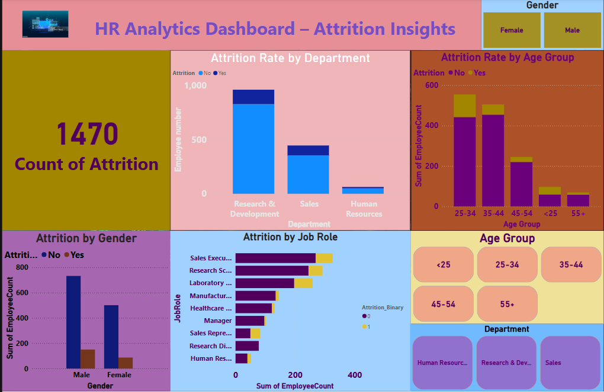

#  HR Attrition Analysis Project

A professional-level end-to-end data analytics project using **Excel**, **SQL**, **Python**, and **Power BI** to analyze and visualize employee attrition. The goal is to identify patterns behind employee turnover and help businesses retain talent more effectively.

## 📁 Project Structure
'''
HR-Attrition-Analysis/
├── Excel/
│ └── final_cleaned_hr_data.xlsx
├── SQL/
│ ├── attrition_by_age_group.sql
│ ├── attrition_by_department.sql
│ ├── attrition_by_gender.sql
│ ├── attrition_by_job_role.sql
│ └── saved_query_results/
├── PowerBI/
│ └── HR_Attrition_Dashboard.pbix
└── README.md
'''

---

## 🧰 Tools & Technologies Used

- **Excel** – for cleaning and formatting the raw HR data
- **SQL** – to run analytical queries and calculate attrition metrics
- **Python (Pandas, Seaborn, Matplotlib)** – to create detailed data visualizations
- **Power BI** – for building an interactive dashboard

---

## ✅ Key Analyses

- 🔹 Attrition Rate by Age Group
- 🔹 Attrition Distribution by Gender
- 🔹 Department-wise Attrition Count & Rate
- 🔹 Attrition by Job Role
- 🔹 Final dashboard in Power BI with key metrics and insights

---

## 📊 Power BI Dashboard Preview

---

## 🔍 Summary of Insights

- **Young employees (<35)** show higher attrition
- **Sales Executive** and **Laboratory Technician** roles have the most turnover
- **Research & Development** department retains more employees
- **Gender** does not show significant attrition difference
- The **Power BI dashboard** provides a real-time executive summary

---

## 🧠 Learning Outcome

This project showcases how to:
- Clean and organize datasets using Excel
- Perform analytical SQL queries on HR data
- Visualize business insights using Python libraries
- Create interactive dashboards using Power BI
- Combine multiple tools for a full-stack analytics solution

---

> *This project is designed to showcase my skills in data cleaning, querying, visualization, and storytelling – everything needed for a professional data analyst role.*

